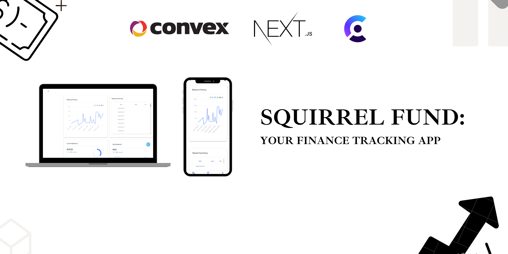

# Squirrel Fund

**Project Overview:**  
This project is a NextJS-based web application that integrates with the Clerk for auth and Convex for backend as a service (BAAS) to help users track their finances. The application has a user friendly interface thanks to MaterialUI.

## Features

- Publish deposits and withdrawals
- See recent deposits and withdrawals
- Have CRUD operations such as adding, deleting, modifying transactions
- View balance history right from the dashboard
- Display toast notifications for user feedback.

## Getting Started

To run this application locally, follow these steps:

**1. Clone the repository:**

```
git clone <repository-url>
```

**2. Install dependencies for both the client and server folders. Split the terminal to have them both running:**

```
npm install
```

**3. Set up environment variables:**

- Create a .env.local file in the root folder and add your `CLERK_PUBLISHABLE_KEY`, `CLERK_SECRET_KEY`, `CONVEX_DEPLOYMENT`, and `CONVEX_URL` tokens.
- Configure other environment variables as needed.

**4. Start the application:**

```
npm run dev
```

**5. Access the application in your browser at http://localhost:3000.**


## Contributors

- <u>Emmanuel Jason De Lara</u>
